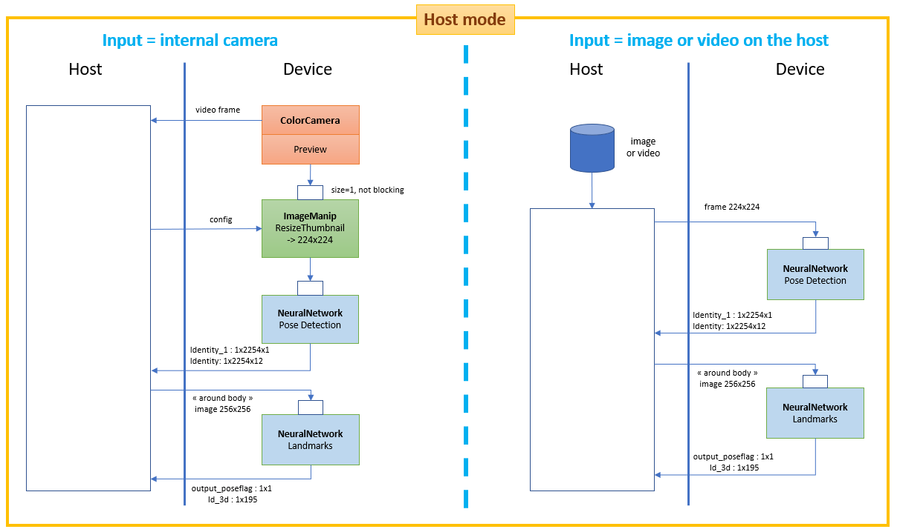
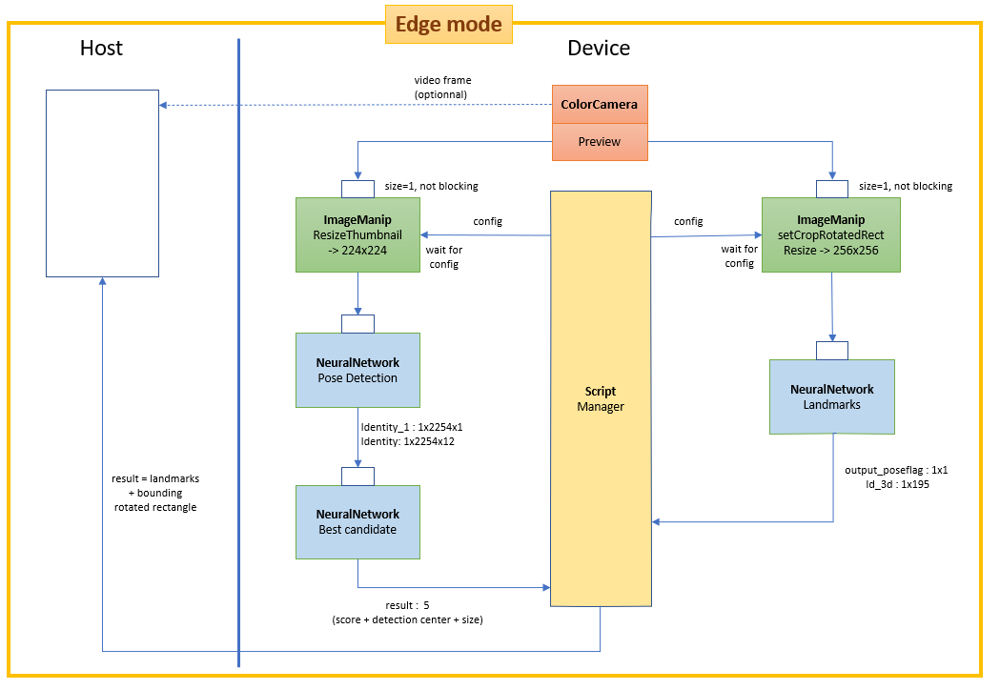

# Blazepose tracking with DepthAI

We will perform pose classification on video input from OpenCV AI Kit with Depth sensor.(OAK-D)

The model used for 3D body joint keypoints detection is Google's mediapipe and [DepthAI](https://docs.luxonis.com/en/gen2/).

We use the keypoints for pose classification into several yoga pose categories like tadasana(mountain pose), bhujangasa (cobra pose), salabhasana (locust pose), etc.

The Blazepose landmark models available in this repository are the version "full", "lite" and "heavy" of mediapipe 0.8.6 (2021/07),

The pose detection model comes from mediapipe 0.8.4 and is compatible with the 3 landmark models.


## Architecture: Host mode vs Edge mode
Two modes are available:
- **Host mode :** aside the neural networks that run on the device, almost all the processing is run on the host (the only processing done on the device is the letterboxing operation before the pose detection network when using the device camera as video source). **Use this mode when you want to infer on external input source (videos, images).**
- **Edge mode :** most of the processing (neural networks, post-processings, image manipulations) is run on the device thaks to the depthai scripting node feature. It works only with the device camera but is **definitely the best option when working with the internal camera** (much faster than in Host mode). The data exchanged between the host and the device is minimal: the landmarks of detected body (~3kB/frame). In Edge mode, you can choose not to send the camera video frame to the host (by specifying 'rgb_laconic' as input).

|Landmark model (Edge mode)| FPS (FPS with 'xyz' option)|
|-|-|
|Full|20 (18)|
|Lite|26 (22)|
|Heavy|8 (7)|
<br>




For depth-capable devices, when measuring the 3D location of a reference point, more nodes are used and not represented here (2 mono cameras, stereo node, spatial location calculator).

## Inferred 3D vs Measured 3D

* **Inferred 3D** : the Landmark model is able to infer 3D (x,y,z) landmarks. Actually, the 0.8.6 model yields 2 outputs with 3D landmarks : Identity (accessed via *body.landmarks* with the API) and Identity_4 (accessed via *body.world_landmarks*). It may sound as redundant information but there  is a difference: *world landmarks* are real-world 3D coordinates in meters with the origin at the center between hips. *world landmarks* share the same landmark topology as *landmarks*. However, *landmarks* provide coordinates (in pixels) of a 3D object projected onto the 2D image surface, while *world landmarks* provide coordinates (in meters) of the 3D object itself.
* **Measured 3D** : for devices able to measure depth (like OAK-D), we can determine the real 3D location of a point of the image in camera coordinate system. So one idea would be to measure the 3D locations of each inferred 2D body landmarks. It turns out it is not a good idea in practice for at least 2 reasons. First, a inferred keypoint may stand "outside" of its counterpart in the image and therefore in the aligned depth frame. It happens probably more frequently with extremities, and it can be explained by the  inaccuracy of the model which is never 100% perfect. Secondly, we can't get depth for hidden keypoints. An alternative solution, implemented here, is to combine the inferred 3D *world landmarks* with the measured 3D location of one reference point, the center between hips. Compared to extremities, this reference point can be more robustly measured.

The image below demonstrates the 3 modes of 3D visualization:
1) **Image mode** (top-right), based on *body.landmarks*. Note that the size of the drawn skeleton depends on the distance camera-body, but that the mid hips reference point is restricted and can only moved inside a plane parallel to the wall grid;
2) **World mode** (bottom-left), based on *body.world_landmarks*. Note the mid hips reference point is fixed and the size of the skeleton does not change;
3) **Mixed mode** (bottom right), mixing *body.world_landmarks* with measured 3D location of the reference point. Like in World mode, the size of the skeleton does not change. But the mid hips reference point is not restricted any more.


## Install

**Currently, the scripting node capabilty is in the *develop* branch.**

Inside a clone of https://github.com/luxonis/depthai-python :
```
git fetch --all
git checkout origin/develop
python3 ./examples/install_requirements.py
```

Install other python packages (opencv, open3d) with the following command:

```python3 -m pip install -r requirements.txt```

## Run

**Usage:**

```
-> python3 demo.py -h
usage: demo.py [-h] [-e] [-i INPUT] [--pd_m PD_M] [--lm_m LM_M] [-xyz] [-c]
               [--no_smoothing] [-f INTERNAL_FPS]
               [--internal_frame_height INTERNAL_FRAME_HEIGHT] [-s] [-t]
               [--force_detection] [-3 {None,image,anchored,world}]
               [-o OUTPUT]

optional arguments:
  -h, --help            show this help message and exit
  -e, --edge            Use Edge mode (postprocessing runs on the device)

Tracker arguments:
  -i INPUT, --input INPUT
                        'rgb' or 'rgb_laconic' or path to video/image file to
                        use as input (default=rgb)
  --pd_m PD_M           Path to an .blob file for pose detection model
  --lm_m LM_M           Landmark model ('full' or 'lite' or 'heavy') or path
                        to an .blob file
  -xyz, --xyz           Get (x,y,z) coords of reference body keypoint in
                        camera coord system (only for compatible devices)
  -c, --crop            Center crop frames to a square shape before feeding
                        pose detection model
  --no_smoothing        Disable smoothing filter
  -f INTERNAL_FPS, --internal_fps INTERNAL_FPS
                        Fps of internal color camera. Too high value lower NN
                        fps (default= depends on the model)
  --internal_frame_height INTERNAL_FRAME_HEIGHT
                        Internal color camera frame height in pixels
                        (default=640)
  -s, --stats           Print some statistics at exit
  -t, --trace           Print some debug messages
  --force_detection     Force person detection on every frame (never use
                        landmarks from previous frame to determine ROI)

Renderer arguments:
  -3 {None,image,anchored,world}, --show_3d {None,image,anchored,world}
                        Display skeleton in 3d in a separate window. See
                        README for description.
  -o OUTPUT, --output OUTPUT
                        Path to output video file
```
**Examples :**

- To use default internal color camera as input with the model "full" in Host mode:

    ```python3 demo.py```

- To use default internal color camera as input with the model "full" in Edge mode [**preferred**]:

    ```python3 demo.py -e```

- To use a file (video or image) as input :

    ```python3 demo.py -i filename```

- To use the model "lite" :

    ```python3 demo.py -lm_m lite```

- To measure body spatial location in camera coordinate system (only for depth-capable device like OAK-D):
    ```python3 demo.py -e -xyz```

    The measure is made only on one reference point:
        - the middle of the hips if both hips are visible;
        - the middle of the shoulders if hips are not visible and both shoulders are visible.

- To show the skeleton in 3D 'world' mode (-xyz flag needed):

    ```python3 demo.py -e -xyz -3 world```

    
    Note that the floor and wall grids does not correspond to a real floor and wall. Each grid square size is 1m x 1m.

- When using the internal camera, to change its FPS to 15 : 

    ```python3 demo.py --internal_fps 15```

    Note: by default, the default internal camera FPS depends on the model, the mode (Edge vs Host), the use of depth ("-xyz"). These default values are based on my own observations. **Please, don't hesitate to play with this parameter to find the optimal value.** If you observe that your FPS is well below the default value, you should lower the FPS with this option until the set FPS is just above the observed FPS.

- When using the internal camera, you probably don't need to work with the full resolution. You can set a lower resolution (and win a bit of FPS) by using this option: 

    ```python3 demo.py --internal_frame_size 450```

    Note: currently, depthai supports only some possible values for this argument. The value you specify will be replaced by the closest possible value (here 432 instead of 450).

- By default, temporal filters smooth the landmark positions. Use *--no_smoothing* to disable the filter.

|Keypress in OpenCV window|Function|
|-|-|
|*Esc*|Exit|
|*space*|Pause|
|r|Show/hide the bounding rotated rectangle around the body|
|l|Show/hide landmarks|
|s|Show/hide landmark score|
|f|Show/hide FPS|
|x|Show/hide (x,y,z) coordinates (only on depth-capable devices and if using "-xyz" flag)|
|z|Show/hide the square zone used to measure depth (only on depth-capable devices and if using "-xyz" flag)|

If using a 3D visualization mode ("-3" or "--show_3d"):
|Keypress in Open3d window|Function|
|-|-|
|o|Oscillating (rotating back and forth) of the view|
|r|Continuous rotating of the view|
|*Up*|Increasing rotating or oscillating speed|
|*Down*|Decreasing rotating or oscillating speed|
|*Right* or *Left*|Change the point of view to a predefined position|
|*Mouse*|Freely change the point of view|

## Mediapipe models 
You can directly find the model files (.xml and .bin) under the 'models' directory. Below I describe how to get the files in case you need to regenerate the models.

1) Clone this github repository in a local directory (DEST_DIR)
2) In DEST_DIR/models directory, download the tflite models from [this archive](https://drive.google.com/file/d/1bEL4zmh2PEFsRfmFOofP0rbGNo-O1p5_/view?usp=sharing). The archive contains:
    * Pose detection model from Mediapipe 0.8.4, 
    * Full, Lite anf Hevay pose landmark modelfrom Mediapipe 0.8.6.

    *Note: the Pose detection model from Mediapipe 0.8.6 can't currently be converted (more info [here](https://github.com/PINTO0309/tflite2tensorflow/issues/11)).*

3) Install the amazing [PINTO's tflite2tensorflow tool](https://github.com/PINTO0309/tflite2tensorflow). Use the docker installation which includes many packages including a recent version of Openvino.
3) From DEST_DIR, run the tflite2tensorflow container:  ```./docker_tflite2tensorflow.sh```
4) From the running container: 
```
cd workdir/models
./convert_models.sh
```
The *convert_models.sh* converts the tflite models in tensorflow (.pb), then converts the pb file into Openvino IR format (.xml and .bin), and finally converts the IR files in MyriadX format (.blob).

5) By default, the number of SHAVES associated with the blob files is 4. In case you want to generate new blobs with different number of shaves, you can use the script *gen_blob_shave.sh*:
```
# Example: to generate blobs for 6 shaves
./gen_blob_shave.sh -m pd -n 6     # will generate pose_detection_sh6.blob
./gen_blob_shave.sh -m full -n 6   # will generate pose_landmark_full_sh6.blob
```

**Explanation about the Model Optimizer params :**
- The preview of the OAK-* color camera outputs BGR [0, 255] frames . The original tflite pose detection model is expecting RGB [-1, 1] frames. ```--reverse_input_channels``` converts BGR to RGB. ```--mean_values [127.5,127.5,127.5] --scale_values [127.5,127.5,127.5]``` normalizes the frames between [-1, 1].
- The original landmark model is expecting RGB [0, 1] frames. Therefore, the following arguments are used ```--reverse_input_channels```, but unlike the detection model, we choose to do the normalization in the python code and not in the models (via ```--scale_values```). Indeed, we have observed a better accuracy with FP16 models when doing the normalization of the inputs outside of the models ([a possible explanation](https://github.com/PINTO0309/tflite2tensorflow/issues/9#issuecomment-842460014)).

## Custom models

The `custom_models` directory contains the code to build the following custom models:
- DetectionBestCandidate: this model processes the outputs of the pose detection network (a 1x2254x1 tensor for the scores and a 1x2254x12 for the regressors) and yields the regressor with the highest score.
- DivideBy255: this model transforms an 256x256 RGB888p ([0, 255]) image to a 256x256 RGBF16F16F16p image ([0., 1.]).

The method used to build these models is well explained on the [rahulrav's blog](https://rahulrav.com/blog/depthai_camera.html).


## Code

To facilitate reusability, the code is splitted in 2 classes:
-  **BlazeposeDepthai**, which is responsible of computing the body landmarks. The importation of this class depends on the mode:
```
# For Host mode:
from BlazeposeDepthai import BlazeposeDepthai
```
```
# For Edge mode:
from BlazeposeDepthaiEdge import BlazeposeDepthai
```
- **BlazeposeRenderer**, which is responsible of rendering the landmarks and the skeleton on the video frame. 

This way, you can replace the renderer from this repository and write and personalize your own renderer (for some projects, you may not even need a renderer).

The file ```demo.py``` is a representative example of how to use these classes:
```
from BlazeposeDepthaiEdge import BlazeposeDepthai
from BlazeposeRenderer import BlazeposeRenderer

# The argparse stuff has been removed to keep only the important code

tracker = BlazeposeDepthai(input_src=args.input, 
            pd_model=args.pd_m,
            lm_model=args.lm_m,
            smoothing=not args.no_smoothing,   
            xyz=args.xyz,           
            crop=args.crop,
            internal_fps=args.internal_fps,
            internal_frame_height=args.internal_frame_height,
            force_detection=args.force_detection,
            stats=args.stats,
            trace=args.trace)   

renderer = BlazeposeRenderer(
                pose, 
                show_3d=args.show_3d, 
                output=args.output)

while True:
    # Run blazepose on next frame
    frame, body = tracker.next_frame()
    if frame is None: break
    # Draw 2d skeleton
    frame = renderer.draw(frame, body)
    key = renderer.waitKey(delay=1)
    if key == 27 or key == ord('q'):
        break
renderer.exit()
tracker.exit()
```

For more information on:
- the arguments of the tracker, please refer to the docstring of class `BlazeposeDepthai` or `BlazeposeDepthaiEdge` in `BlazeposeDepthai.py` or `BlazeposeDepthaiEdge.py`;
- the attributes of the 'body' element you can exploit in your program, please refer to the doctring of class `Body` in `mediapipe_utils.py`.

- **yoga_pose_recognizer.py** - 
    - ```
    predicted_pose = recognize_pose(body,
                                    expected_pose,
                                    track)
    ```
    - We have a loop which runs till "q" is pressed, gives us the next frame
    - We get result from device - Marshall
    - We get video input nd extract frame
    - If landmark score of result > threshold, we initialise a new mpu.Body object as ```body```.
    - We store all the attributes like body rotation, landmark score.
    - Then landmark post process.
    - body.xyz : center of hips
    - BlazeposeDepthAIEdge.nextframe returns the video frame and body
    - Now we send body and expected pose and track arguments as input to recignize pose function.
    - First we initialise the pose string
    - We define a full body pose embedder object - ```pose_embedder```
    - We initialize the pose folder based on the track
    - We define a Pose Classifier - ```pose_classifier``` 
        ```
        pose_classifier = PoseClassifier(
            pose_samples_folder=pose_folder,
            pose_embedder=pose_embedder,
            top_n_by_max_distance=30,
            top_n_by_mean_distance=10)
        ```
    - We have 33 joint points with x y z coordinates.
    - 
    - We get the body joint landmark x, y and z coordinates using body.landmarks.
    - pose_classification = pose_classifier(r.landmarks)
    - ```
    pose_classification_filter = EMADictSmoothing(
            window_size=10,
            alpha=0.2)

        # Smooth classification using EMA.
        pose_classification_filtered = pose_classification_filter(
            pose_classification)
    ```
    - We use get_3D_Angle() function to use x,y,z coordinates of three joint keypoints and calculate angle between two vectors in three dimensional space.
    - We get 7 different angles values for this video frame. For examples, this is the left arm angle with joints as left shoulder, left elbow and left wrist.
    ```LEFT_ARM_ANGLE = get3DAngle(
            r.landmarks[12, :3], r.landmarks[14, :3], r.landmarks[16, :3])
    ```
    - This is to calculate feedback for each frame
    - We initialise pose angles to the pose angles we expect
    - We calculate the differences of this specific frames's pose angles with expected pose angles.
    - We only consider the top 2 joint angles with max absolute difference.
    - We only print feedback, pose name and accuracy if predicted pose is equal to expected pose.
    - Accuracy is calculated using weighted average of top 10 classes and pose angle differences.
- FullBodyPoseEmbedder - Converts 3D pose landmarks into 3D embedding.
    - _normalize_pose_landmarks - Normalizes landmarks translation and scale.
        - _get_pose_center - Calculates pose center as point between hips.
        - _get_pose_size 
            - Calculates pose size.
            It is the maximum of two values:
                - Torso size multiplied by `torso_size_multiplier`
                - Maximum distance from pose center to any pose landmark.
            - _get_pose_center
        
    - _get_pose_distance_embedding 
        Converts pose landmarks into 3D embedding.

        We use several pairwise 3D distances to form pose embedding. All distances
        include X and Y components with sign. We differnt types of pairs to cover
        different pose classes. Feel free to remove some or add new.

        Args:
        landmarks - NumPy array with 3D landmarks of shape (N, 3).

        Result:
        Numpy array with pose embedding of shape (M, 3) where `M` is the number of
        pairwise distances.
    - 
- Pose Sample Class
- Pose Classifier - Classifies pose landmarks.
    - _load_pose_samples
    Classifies given pose.

    Classification is done in two stages:
      * First we pick top-N samples by MAX distance. It allows to remove samples
        that are almost the same as given pose, but has few joints bent in the
        other direction.
      * Then we pick top-N samples by MEAN distance. After outliers are removed
        on a previous step, we can pick samples that are closes on average.

    Args:
      pose_landmarks: NumPy array with 3D landmarks of shape (N, 3).

    Returns:
      Dictionary with count of nearest pose samples from the database. Sample:
      ```{
          'pushups_down': 8,
          'pushups_up': 2,
        }
- EMADictSmoothing
    Smoothes given pose classification.

        Smoothing is done by computing Exponential Moving Average for every pose
        class observed in the given time window. Missed pose classes arre replaced
        with 0.

        Args:
        data: Dictionary with pose classification. Sample:
            {
                'pushups_down': 8,
                'pushups_up': 2,
            }

        Result:
        Dictionary in the same format but with smoothed and float instead of
        integer values. Sample:
            {
            'pushups_down': 8.3,
            'pushups_up': 1.7,
            } 


## Credits
* [Google Mediapipe](https://github.com/google/mediapipe)
* Katsuya Hyodo a.k.a [Pinto](https://github.com/PINTO0309), the Wizard of Model Conversion !
* [Tai Chi Step by Step For Beginners Training Session 4](https://www.youtube.com/watch?v=oawZ_7wNWrU&ab_channel=MasterSongKungFu)
* [Semaphore with The RCR Museum](https://www.youtube.com/watch?v=DezaTjQYPh0&ab_channel=TheRoyalCanadianRegimentMuseum)
* Movenet on DepthAI, please visit : [depthai_movenet](https://github.com/geaxgx/depthai_movenet)
* [On Device Real Time Body Pose Tracking](https://ai.googleblog.com/2020/08/on-device-real-time-body-pose-tracking.html)

## Authors
* [Soumi7](https://github.com/Soumi7/)
* [sbis04](https://github.com/sbis04/)
* [geaxgx](https://github.com/geaxgx/)