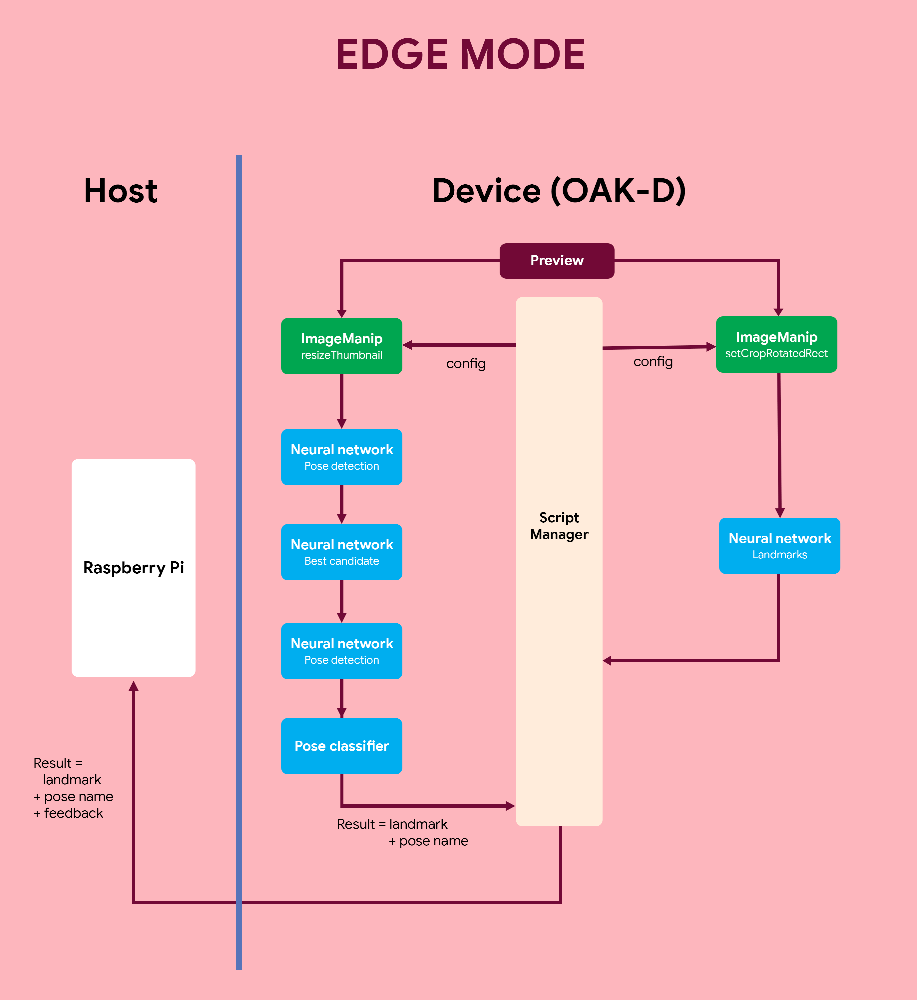

# OAK-D Blazepose yoga pose classification

Running Google Mediapipe body pose tracking models on [DepthAI](https://docs.luxonis.com/en/gen2/) hardware (OAK-1, OAK-D, ...) and classifying yoga poses.


## Edge mode

Two modes are available: Host and Edge. We have used the Edge mode to reduce the computation on the host device and perform most of the processing on the OAK-D device.



In the **Edge mode,** the depthai scripting node feature enables the device to run ****most of the processing (neural networks, post-processings, image manipulations). It works only with the device camera but is **definitely the best option when working with the internal camera**. The data exchanged between the host and the device is minimal: the landmarks of detected body (~3kB/frame).

We are using 'rgb_laconic' as input because we don't need the camera video frames on the host (we are just using the landmark data to recreate on the mobile device) and this helps to reduce the computation on the Raspberry Pi significantly.

|Landmark model (Edge mode)| FPS (FPS with 'xyz' option)|
|-|-|
|Full|20 (18)|
|Lite|26 (22)|
|Heavy|8 (7)|

For depth-capable devices, when measuring the 3D location of a reference point, more nodes are used and not represented here (2 mono cameras, stereo node, spatial location calculator).


## Install dependencies

Install the python packages DepthAI, Opencv, open3d with the following command:

```sh
python3 -m pip install -r requirements.txt
```

## Usage

To use yoga pose classification:
  
```sh
python3 yoga_pose_recognizer.py --expected_pose mountain --track beginners
```

## License

MIT License

Copyright (c) 2021  geaxgx, Soumi7 (Soumi Bardhan), sbis04 (Souvik Biswas)

Permission is hereby granted, free of charge, to any person obtaining a copy
of this software and associated documentation files (the "Software"), to deal
in the Software without restriction, including without limitation the rights
to use, copy, modify, merge, publish, distribute, sublicense, and/or sell
copies of the Software, and to permit persons to whom the Software is
furnished to do so, subject to the following conditions:

The above copyright notice and this permission notice shall be included in all
copies or substantial portions of the Software.

THE SOFTWARE IS PROVIDED "AS IS", WITHOUT WARRANTY OF ANY KIND, EXPRESS OR
IMPLIED, INCLUDING BUT NOT LIMITED TO THE WARRANTIES OF MERCHANTABILITY,
FITNESS FOR A PARTICULAR PURPOSE AND NONINFRINGEMENT. IN NO EVENT SHALL THE
AUTHORS OR COPYRIGHT HOLDERS BE LIABLE FOR ANY CLAIM, DAMAGES OR OTHER
LIABILITY, WHETHER IN AN ACTION OF CONTRACT, TORT OR OTHERWISE, ARISING FROM,
OUT OF OR IN CONNECTION WITH THE SOFTWARE OR THE USE OR OTHER DEALINGS IN THE
SOFTWARE.
